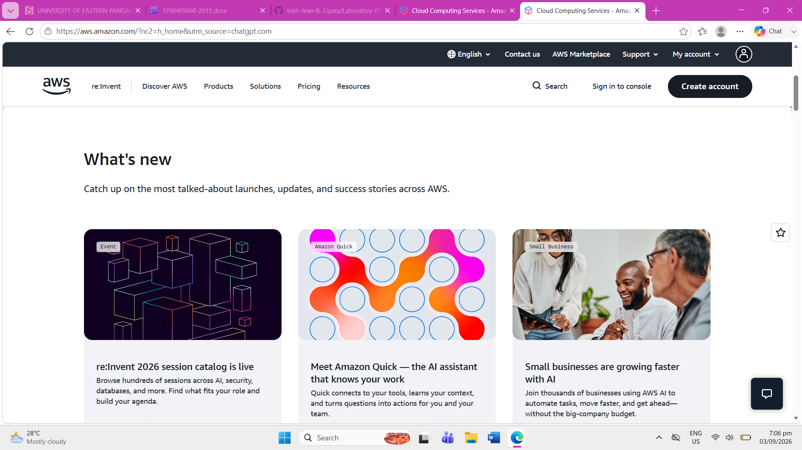

# AWS Research

## Brief Overview

Amazon Web Services (AWS) is a cloud computing platform that provides a wide range of cloud services for organizations. AWS helps businesses accelerate innovation, reduce costs, and scale their applications and infrastructure efficiently.

## Global Infrastructure

AWS has a global cloud infrastructure made up of geographic Regions and Availability Zones. An AWS Region is a physical geographic area where AWS operates data centers. Availability Zones are isolated locations within a Region that provide independent infrastructure for improved availability and fault tolerance.

As of 2026, AWS has 39 Geographic Regions and 124 Availability Zones. Each AWS Region has at least three Availability Zones.

## Cloud Management Console

The AWS Management Console is a web-based interface used to access and manage AWS cloud services and resources. Users can use the console to configure and monitor services such as computing, storage, databases, and networking.

## Four Core Services

### 1. Amazon EC2

Amazon Elastic Compute Cloud (EC2) provides secure and resizable computing capacity through virtual servers in the cloud. It can be used to run applications and workloads without maintaining physical servers.

### 2. Amazon S3

Amazon Simple Storage Service (S3) is an object storage service used to store and retrieve data. It can be used for backups, applications, data lakes, and other storage needs.

### 3. Amazon RDS

Amazon Relational Database Service (RDS) is a managed relational database service. It helps organizations set up, operate, back up, and scale relational databases.

### 4. Amazon VPC

Amazon Virtual Private Cloud (VPC) allows users to create a logically isolated virtual network within AWS. It provides control over IP addresses, subnets, routing, and network security.

## Three Advantages

1. **Scalability** – AWS allows organizations to increase or decrease computing resources based on their needs.

2. **Global Infrastructure** – AWS provides Regions and Availability Zones around the world, allowing organizations to deploy applications closer to their users.

3. **Security** – AWS provides security features and infrastructure designed to protect workloads and data.

## Typical Enterprise Use Cases

AWS is used by organizations in many industries, including financial services, healthcare, government, telecommunications, manufacturing, media, and gaming.

Common enterprise use cases include:

- Hosting web applications
- Data storage and backup
- Database management
- Artificial intelligence and machine learning
- Data analytics
- Enterprise application development
- Disaster recovery

## Screenshot

