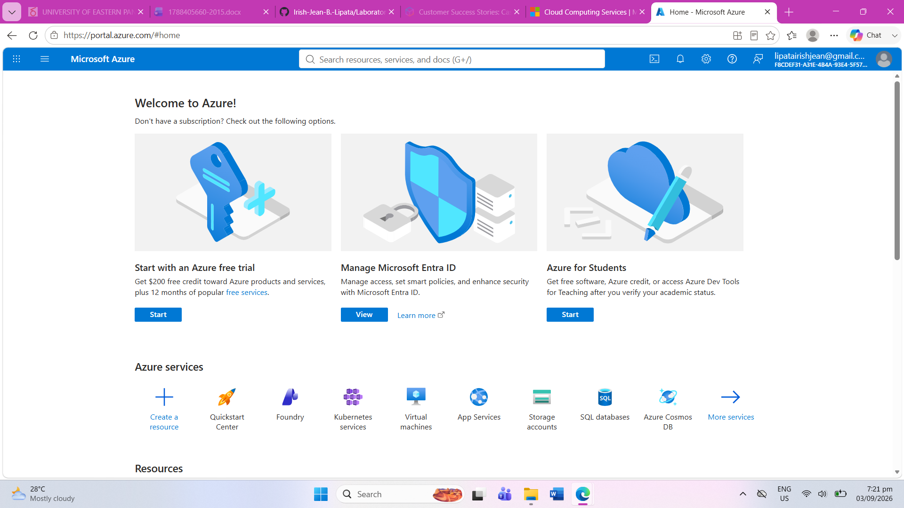

# Microsoft Azure Research

## Brief Overview

Microsoft Azure is a cloud computing platform provided by Microsoft. It offers cloud services for computing, storage, databases, networking, artificial intelligence, security, and application development. Azure supports cloud, hybrid, and edge environments.

## Global Infrastructure

Azure has a global infrastructure made up of geographies, regions, and datacenters. An Azure geography contains one or more regions and helps organizations meet data residency and compliance requirements. Azure also provides Availability Zones in supported regions to improve application availability and resilience.

## Cloud Management Console

The Azure Portal is a web-based management console used to create, manage, and monitor Azure resources. Users can manage services such as virtual machines, databases, storage, networking, subscriptions, and costs through a graphical interface.

## Four Core Services

### 1. Azure Virtual Machines

Azure Virtual Machines provides scalable computing capacity for running applications and workloads using Windows or Linux virtual machines.

### 2. Azure Blob Storage

Azure Blob Storage is an object storage service used to store large amounts of unstructured data. It can support applications, data lakes, backups, and other workloads.

### 3. Azure SQL Database

Azure SQL Database is a fully managed relational database service based on the SQL Server database engine. It provides scalability, high availability, security, and automated management.

### 4. Azure Virtual Network

Azure Virtual Network allows organizations to create private networks in Azure. It provides network isolation and can connect cloud resources with on-premises infrastructure.

## Three Advantages

1. **Microsoft Integration** – Azure works well with Microsoft technologies such as Windows Server, Microsoft 365, and Microsoft Entra ID.

2. **Scalability** – Azure allows organizations to scale computing, storage, and networking resources according to their workload requirements.

3. **Security and Reliability** – Azure provides security features, compliance capabilities, and infrastructure designed to support highly available and resilient workloads.

## Typical Enterprise Use Cases

Azure is commonly used by organizations for:

- Cloud migration and modernization
- Windows Server workloads
- Application hosting
- Database management
- Data analytics
- Artificial intelligence and machine learning
- Hybrid cloud environments
- Backup and disaster recovery
- Enterprise application development

## Screenshot

