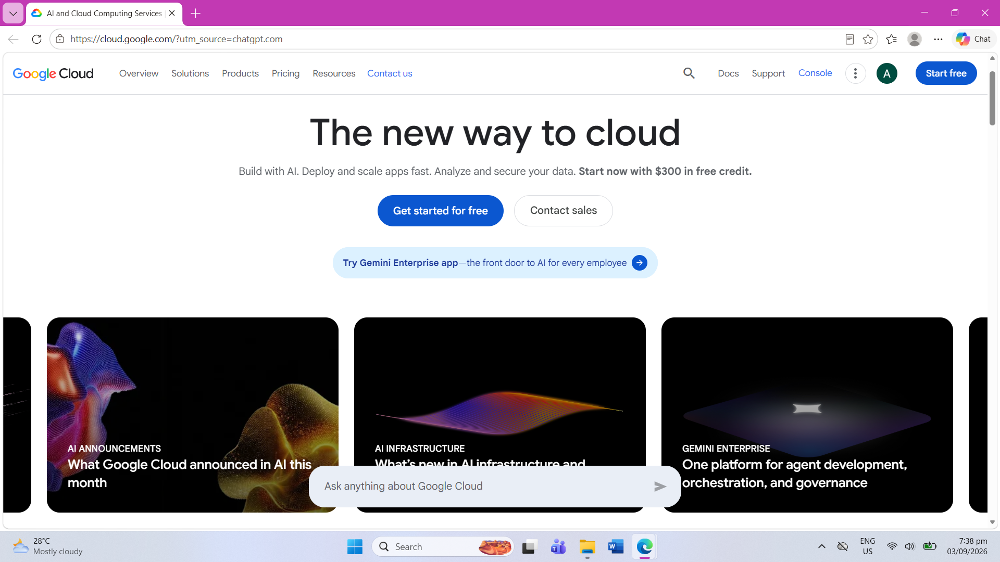

# Google Cloud Platform (GCP) Research

## Brief Overview

Google Cloud Platform (GCP), also known as Google Cloud, is a cloud computing platform provided by Google. It provides services for computing, storage, databases, networking, artificial intelligence, data analytics, security, and application development.

Google Cloud helps organizations accelerate digital transformation and solve business and technology challenges. It also provides services for AI, multicloud environments, data management, security, and modern infrastructure.

## Global Infrastructure

Google Cloud has a global infrastructure made up of regions and zones. A region is an independent geographic area containing multiple zones, while a zone is an isolated deployment area within a region.

Google Cloud provides infrastructure across North America, South America, Europe, Asia, the Middle East, and Australia. Organizations can choose regions and zones based on latency, availability, data residency, and durability requirements.

As of 2026, Google Cloud lists 43 regions and 130 zones. Google Cloud also provides a global network and infrastructure designed for high availability and reliability.

## Cloud Management Console

The Google Cloud Console is a web-based graphical interface used to manage Google Cloud projects and resources. Users can use the console to create, configure, monitor, and manage cloud services.

The Google Cloud Console can be used together with other management methods such as the Google Cloud CLI and APIs.

## Four Core Services

### 1. Compute Engine

Compute Engine provides virtual machines that run on Google's infrastructure. It can be used to host applications, websites, databases, and other workloads.

### 2. Cloud Storage

Cloud Storage is an object storage service used to store and retrieve data in Google Cloud. It can be used for application data, backups, data processing, and other storage requirements.

### 3. Cloud SQL

Cloud SQL is a fully managed relational database service. It supports database engines such as MySQL, PostgreSQL, and SQL Server.

### 4. Virtual Private Cloud (VPC)

Google Cloud VPC provides networking functionality for cloud resources such as virtual machines, Kubernetes workloads, and serverless applications. It allows organizations to create scalable and flexible network configurations.

## Three Advantages

1. **Artificial Intelligence and Machine Learning** – Google Cloud provides AI and machine learning technologies and infrastructure for organizations developing intelligent applications.

2. **Global Infrastructure** – Google Cloud provides regions, zones, and a global network that allow organizations to deploy applications around the world.

3. **Data and Analytics** – Google Cloud provides data services that help organizations manage data and make data-driven decisions.

## Typical Enterprise Use Cases

Google Cloud can be used by organizations for:

- Artificial intelligence and machine learning
- Data analytics
- Application development
- Cloud migration
- Website and application hosting
- Database management
- Data storage and backup
- Kubernetes and container deployment
- Multicloud environments
- Enterprise digital transformation

## Screenshot

